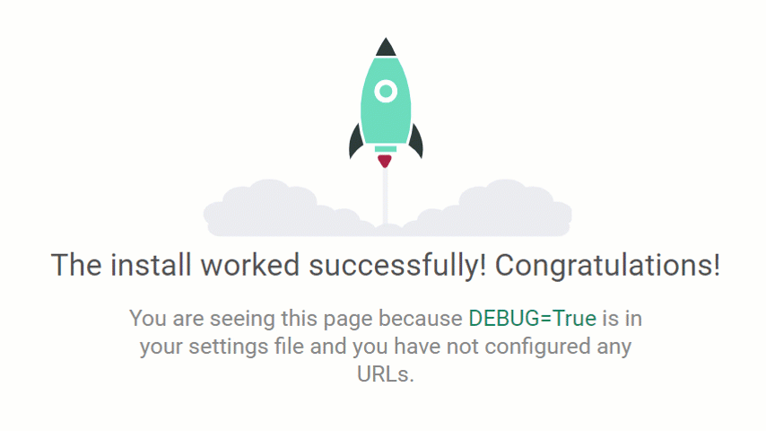
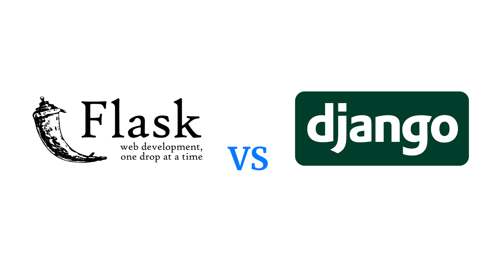
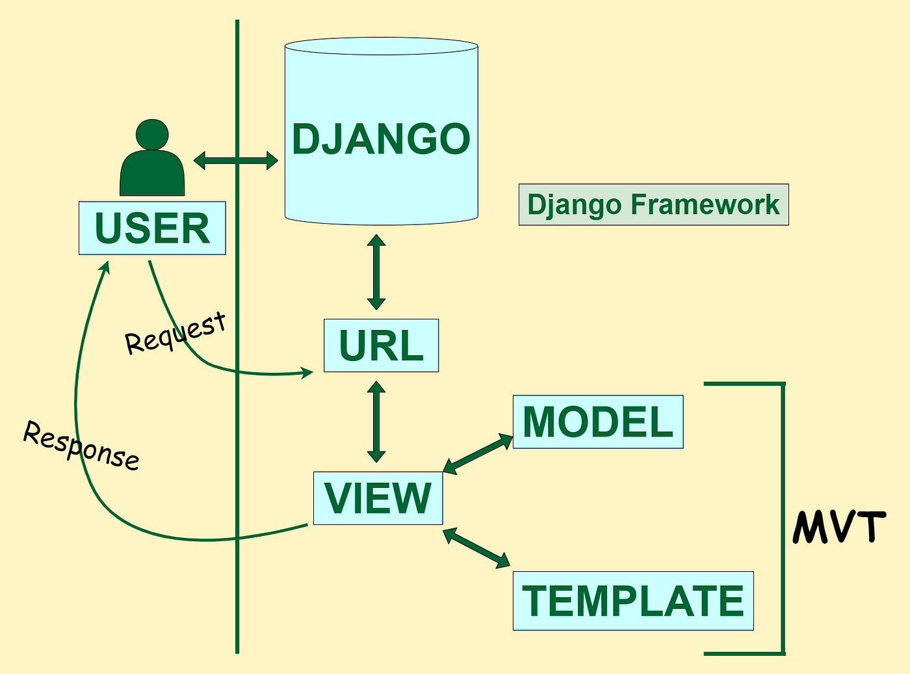
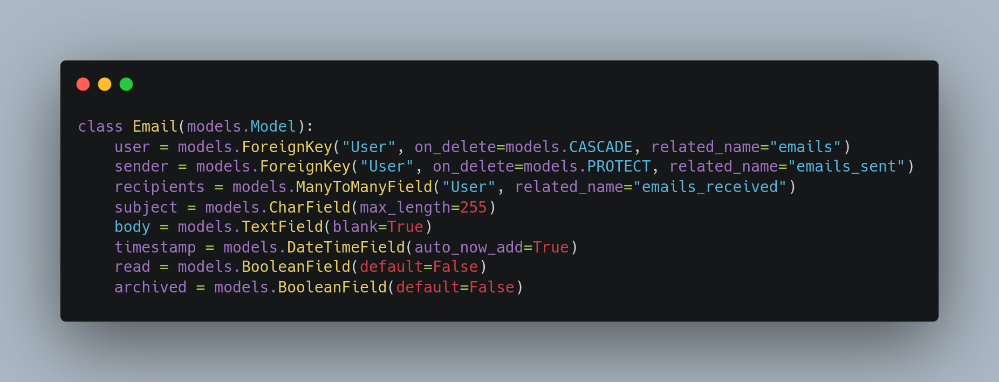
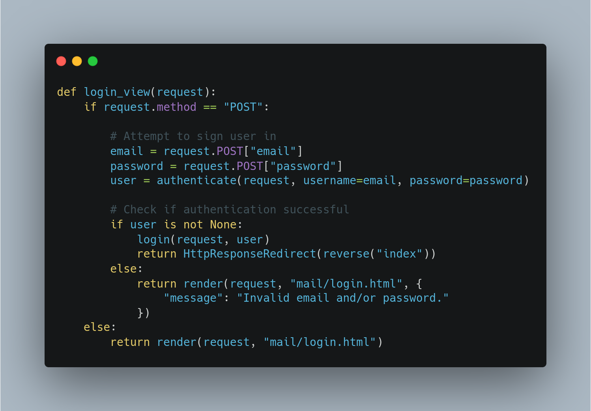
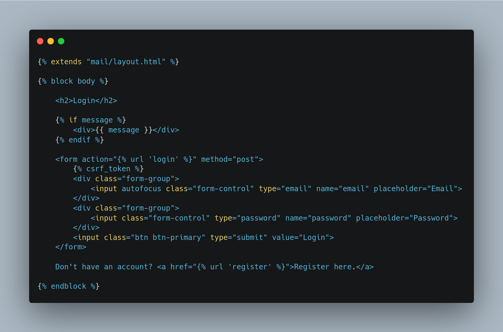
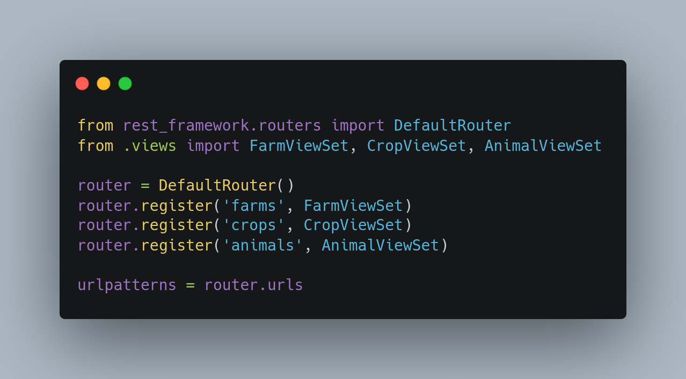

# Django Questions

## What is the difference between Flask and Django?

| Feature               | Flask                                     | Django                           |
|-----------------------|-------------------------------------------|----------------------------------|
| **Type**              | Microframework                            | Full-stack framework             |
| **Complexity**        | Lightweight, minimalistic                 | More complex, batteries-included |
| **Flexibility**       | High (you choose components)              | Low (comes with built-in tools)  |
| **Database Support**  | No built-in ORM                           | Built-in ORM (Django ORM)        |
| **Admin Interface**   | Not included                              | Built-in admin interface         |
| **Learning Curve**    | Easier for beginners                      | Steeper learning curve           |
| **Use Case**          | Small to medium projects                  | Large, complex projects          |
| **Template Engine**   | Jinja2 (default)                          | Django Template Language         |
| **REST API Support**  | Requires extensions (e.g., Flask-RESTful) | Built-in (Django REST Framework) |
| **Community**         | Large, but smaller than Django            | Very large and mature            |

## What is Django?

- Django is python based web deveolpment Framwork.
- Free and Open-source.
- comes with ready-to-use features like login system, database connection and CRUD operations.

## How does Django Work?

**Django follows the MVT design pattern (Model View Template).**

- Model: The data you want to present, usually data from a database.
- View: A request handler that returns the relevant template and content based on the request from the user
- Template: A text file (like an HTML file) containing the layout of the web page, with logic on how to display the  data.

**Model**

- In Django, the data is delivered as an Object Relational Mapping (ORM), which is a technique designed to make it   easier to work with databases.
- The most common way to extract data from a database is SQL. One problem with SQL is that you have to have a pretty good understanding of the database structure to be able to work with it.
- Django, with ORM, makes it easier to communicate with the database, without having to write complex SQL statements.
- The models are usually located in a file called `models.py.`

**View**

- A view is a function or method that takes http requests as arguments, imports the relevant model(s), and finds out what data to send to the template, and returns the final result.
- The views are usually located in a file called `views.py.`

**Template**

- A template is a file where you describe how the result should be represented.
- Templates are often `.html` files, with HTML code describing the layout of a web page, but it can also be in other file formats to present other results, but we will concentrate on `.html` files.
- Django uses standard HTML to describe the layout, but uses Django tags to add logic:

**URLs**

- Django also provides a way to navigate around the different pages in a website.
- When a user requests a URL, Django decides which view it will send it to.
- This is done in a file called `urls.py.`
- 

## How MVT pattern is Django's approach work under the hood?

1. Django receives the URL, checks the `urls.py` file, and calls the view that matches the URL.
2. The view, located in `views.py`, checks for relevant models.
3. The models are imported from the `models.py` file.
4. The view then sends the data to a specified template in the `template` folder.
5. The template contains HTML and Django tags, and with the data it returns finished HTML content back to the browser.
