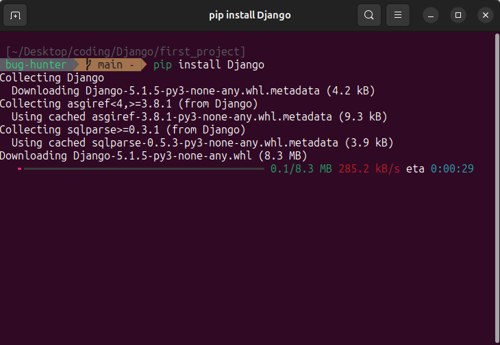

# Django Questions


## What is the difference between Flask and Django?


| Feature               | Flask                                     | Django                           |
|-----------------------|-------------------------------------------|----------------------------------|
| **Type**              | Microframework                            | Full-stack framework             |
| **Complexity**        | Lightweight, minimalistic                 | More complex, batteries-included |
| **Flexibility**       | High (you choose components)              | Low (comes with built-in tools)  |
| **Database Support**  | No built-in ORM                           | Built-in ORM (Django ORM)        |
| **Admin Interface**   | Not included                              | Built-in admin interface         |
| **Learning Curve**    | Easier for beginners                      | Steeper learning curve           |
| **Use Case**          | Small to medium projects                  | Large, complex projects          |
| **Template Engine**   | Jinja2 (default)                          | Django Template Language         |
| **REST API Support**  | Requires extensions (e.g., Flask-RESTful) | Built-in (Django REST Framework) |
| **Community**         | Large, but smaller than Django            | Very large and mature            |
---

## What is Django?

- Django is python based web deveolpment Framwork.
- Free and Open-source.
- comes with ready-to-use features like login system, database connection and CRUD operations.
---

## How does Django Work?

**Django follows the MVT design pattern (Model View Template).**

- Model: The data you want to present, usually data from a database.
- View: A request handler that returns the relevant template and content based on the request from the user
- Template: A text file (like an HTML file) containing the layout of the web page, with logic on how to display the  data.


**Model**

- In Django, the data is delivered as an Object Relational Mapping (ORM), which is a technique designed to make it   easier to work with databases.
- The most common way to extract data from a database is SQL. One problem with SQL is that you have to have a pretty good understanding of the database structure to be able to work with it.
- Django, with ORM, makes it easier to communicate with the database, without having to write complex SQL statements.
- The models are usually located in a file called `models.py.`


**View**

- A view is a function or method that takes http requests as arguments, imports the relevant model(s), and finds out what data to send to the template, and returns the final result.
- The views are usually located in a file called `views.py.`


**Template**

- A template is a file where you describe how the result should be represented.
- Templates are often `.html` files, with HTML code describing the layout of a web page, but it can also be in other file formats to present other results, but we will concentrate on `.html` files.
- Django uses standard HTML to describe the layout, but uses Django tags to add logic:


**URLs**

- Django also provides a way to navigate around the different pages in a website.
- When a user requests a URL, Django decides which view it will send it to.
- This is done in a file called `urls.py.`


---

## How MVT pattern Django's approach work under the hood?

1. Django receives the URL, checks the `urls.py` file, and calls the view that matches the URL.
2. The view, located in `views.py`, checks for relevant models.
3. The models are imported from the `models.py` file.
4. The view then sends the data to a specified template in the `template` folder.
5. The template contains HTML and Django tags, and with the data it returns finished HTML content back to the browser.
---

## What is Virtual Environment ?


- A virtual environment is a tool that helps to keep dependencies required by different projects separate by creating isolated Python virtual environments for them. This is one of the most important tools that most Python developers use.

### Why do we need a virtual environment?
- Creating a Python virtual environment allows you to manage dependencies separately for different projects, preventing conflicts and maintaining cleaner setups. With Python’s venv module, you can create isolated environments that use different versions of libraries or Python itself.
---

## How to Create a Django Project

1. **First, create a directory for the project:**

   

   - Use the following command to create a directory:
     ```bash
     mkdir first_project
     ```
   - Navigate into the directory:
     ```bash
     cd first_project
     ```

---

2. **Set up a virtual environment:**

   

   - Create a virtual environment using:
     ```bash
     python -m venv env
     ```
   - If you encounter issues, install `virtualenv` globally:
     ```bash
     pip install virtualenv
     ```
     Then, try creating the virtual environment again.

---

3. **Activate the virtual environment:**

   

   - On macOS/Linux:
     ```bash
     source env/bin/activate
     ```
   - On Windows:
     ```bash
     env\Scripts\activate
     ```

---

4. **Install Django:**

   

   - Use `pip` to install Django:
     ```bash
     pip install Django
     ```

---

5. **Create a Django project:**

   

   - Use the `django-admin` command to create a new project:
     ```bash
     django-admin startproject login_system
     ```
     - **`django-admin`**: Django’s command-line utility for administrative tasks.
     - **`startproject`**: The command to create a new Django project.
     - **`login_system`**: The name of your project.

---

6. **Navigate into the project directory:**

   - Move into the newly created project directory:
     ```bash
     cd login_system
     ```

---

7. **Run the development server:**

   

   - Start the Django development server:
     ```bash
     python manage.py runserver
     ```

---

8. **Verify the project:**

   - Open your browser and navigate to:
     ```
     http://127.0.0.1:8000/
     ```
   - If everything is set up correctly, you should see the Django welcome page:

     

---
## Django Project Structure

```
first_project/
├── manage.py
├── login_system/
│   ├── __init__.py
│   ├── asgi.py
│   ├─ settings.py
│   ├─ urls.py
│   ├── wsgi.py
```
- first_project/: is your top-level project folder.
- first_project/login_system/: is your lower-level folder that represents your management app.
- manage.py: is a Python file that serves as the command center of your project. It does the same as the django-admin command-line utility.
- settings.py: this file houses the settings that configure your Django project. From database configurations to middleware lists, this is where you define how your application functions. It’s akin to the blueprint that shapes the structure of your project’s behavior.
- urls.py: The URL dispatcher — encoded within urls.py—maps URLs to views. This file determines which view is displayed when a specific URL is accessed. It's like a roadmap that navigates users through the intricacies of your application's pages.
- wsgi.py: Short for Web Server Gateway Interface, wsgi.py serves as the entry point for your application when deployed on a production server. It's the bridge connecting your application to the web server, enabling it to handle incoming requests.
- asgi.py: Similar to wsgi.py, asgi.py is the entry point for asynchronous web servers. It stands for Asynchronous Server Gateway Interface and facilitates the handling of asynchronous HTTP requests.
- __ init __.py:  Python uses this file to declare a folder as a package, which allows Django to use code from different apps to compose the overall functionality of your web application. You probably won’t have to touch this file.

---
## Django app

- Every project you build with Django can contain multiple Django apps. When you ran the startproject command in the previous section, you created a management app that you’ll need for every default project that you’ll build. Now, you’ll create a Django app that’ll contain the specific functionality of your web application.
- python manage.py startapp < appname >

``python manage.py startapp login_app`` 
  


- Once the startapp command has finished execution, you’ll see that Django has added another folder to your folder structure:

```
first_project/
│
├── login_app/
│   │
│   ├── migrations/
│   │   └── __init__.py
│   │
│   ├── __init__.py
│   ├── admin.py
│   ├── apps.py
│   ├── models.py
│   ├── tests.py
│   └── views.py
│
├── login_system/
│   ├── __init__.py
│   ├── asgi.py
│   ├── settings.py
│   ├── urls.py
│   └── wsgi.py
│
└── manage.py
```

- models.py: This is where you define the data structures using Django's ORM (Object-Relational Mapping). Each model class represents a table in the database. This file forms the foundation of your application's data management.
- views.py: file encapsulates the logic that defines how your application interacts with users' requests. Views handle data processing, rendering templates, and responding to actions. This file transforms user interactions into tangible responses.
- tests.py: Here, you write unit tests to ensure your application's components function as expected. These tests bolster the reliability and stability of your codebase.
- admin.py: he admin.py file isn't just for administrators—it configures how your application's models are presented in Django's admin interface. This file allows administrators to manage data seamlessly.
- migrations: This directory is a blueprint of all changes in your application models.
- Other Files: Additional files might surface based on your application’s needs. For instance, forms.py houses form classes for data input, urls.py maps URLs to views, and apps.py manages application-specific configurations.

---

## Directory Hierarchy

- Maintaining a clean and organized project structure is crucial for the readability, scalability, and maintainability of your Django project. Following best practices in project structuring ensures that your codebase is easily understandable and adaptable.

```
first_project/
├── manage.py
├── login_system/
│   ├── __init__.py
│   ├── asgi.py
│   ├─ settings.py
│   ├─ urls.py
│   ├── wsgi.py
├── login_app/
├── logout_app/

├── static/
├── media/
├── templates/

```

- first_project: The root directory of your project.
- first_project/login_system/:This inner directory holds core project settings and configuration.
- login_app & logout_app: These are the individual apps you create within the project.
- static: Houses static files like CSS, JavaScript, and images.
- media: Stores user-uploaded files.
- templates: Contains HTML templates.

---

## What is Django Admin ?

- The Django admin panel is a built-in, user-friendly interface that allows developers and administrators to manage the data and administration of a Django project effortlessly. It provides a convenient way to perform common tasks such as creating, reading, updating, and deleting data in your database without having to write custom views or templates.


- To enter the admin user interface, start the server by navigating to the /first_project folder and execute this command: `py manage.py runserver`

- In the browser window, type 127.0.0.1:8000/admin/ in the address bar.


-The reason why this URL goes to the Django admin log in page can be found in the urls.py file of your project:

```
    urlpatterns = [
        path('admin/', admin.site.urls),
    ]
```

- The urlpatterns[] list takes requests going to admin/ and sends them to admin.site.urls, which is part of a built-in application that comes with Django, and contains a lot of functionality and user interfaces, one of them being the log-in user interface.

- To be able to log into the admin application, we need to create a user.

```bash
  $ python manage.py createsuperuser
  Username: admin
  Email address: admin@example.com
  Password: ********
  Password (again): ********
  Superuser created successfully.
```

---

### Django Admin Commands

| **Command**                          | **Description**                                                                 |
|--------------------------------------|---------------------------------------------------------------------------------|
| `django-admin startproject <name>`   | Creates a new Django project with the specified name.                           |
| `django-admin startapp <name>`       | Creates a new Django app within the project.                                    |
| `python manage.py runserver`         | Starts the Django development server.                                           |
| `python manage.py migrate`           | Applies database migrations to sync the database with your models.              |
| `python manage.py makemigrations`    | Creates new migrations based on changes to your models.                         |
| `python manage.py createsuperuser`   | Creates a superuser for accessing the Django admin interface.                   |
| `python manage.py collectstatic`     | Collects static files into the directory specified in `STATIC_ROOT`.            |
| `python manage.py shell`             | Opens the Django interactive shell with the project’s settings loaded.          |
| `python manage.py test`              | Runs tests for all installed apps.                                              |
| `python manage.py flush`             | Deletes all data from the database and re-applies migrations.                   |
| `python manage.py dbshell`           | Opens the database shell for the database specified in `settings.py`.           |
| `python manage.py showmigrations`    | Lists all migrations and their status (applied or not).                         |
| `python manage.py sqlmigrate <app> <migration>` | Prints the SQL statements for a specific migration.             |
| `python manage.py check`             | Checks the entire Django project for common problems.                           |
| `python manage.py changepassword <username>` | Changes the password for a user.                                |
| `python manage.py clearsessions`     | Clears expired sessions from the session store.                                 |
| `python manage.py compilemessages`   | Compiles `.po` files into `.mo` files for translation.                          |
| `python manage.py inspectdb`         | Inspects the database and generates Django models for existing tables.          |
| `python manage.py loaddata <fixture>`| Loads data from a fixture (e.g., JSON or XML) into the database.                |
| `python manage.py dumpdata <app>`    | Dumps data from the database into a fixture (e.g., JSON or XML).                |

---

## What is Django signals?

- Django signals are a form of signal dispatching mechanisms that allow senders to notify a set of receivers when certain actions are executed in Django Framework.


## Why Use Django Signals?

- Django signals shine in scenarios requiring actions to be triggered by changes in your models. They facilitate a clean, decoupled architecture by allowing different parts of your application to communicate indirectly. Whether you're logging activity, sending notifications, or updating related objects upon changes, signals provide a robust, scalable way to implement these features without tightly coupling your components.

## How do Django signals work?

- In a communication system, a transmitter encodes a message to create a signal, which is carried to a receiver by the communication channel. In Django we have a similar approach, at its core, the signal dispatching system enables certain senders (usually Django models) to notify asset of receivers (functions or methods) when certain events occur. For instance, you might want to automatically send a welcome email to a user immediately after their account has been created. With Django signals, this process is streamlined: a signal is dispatched when a new user is saved, and a receiver function listening for this signal triggers the email sending process

- **Example**
    . pre_save: is event happend befor save to database.
    . post_save: is event happend after save to database.
    
- in this example The post_save signal is triggered after an instance of a model is saved to the database. 
    ````
    ### signals.py file
    from django.db.models. signals import post_save
    from django.dispatch import receiver
    from .models import ArticleComments

    @receiver(post_save, sender=ArticleComments)
    def notify_author(sender, instance, created, ** kwargs) :
        if created:
        # call your function to notify instance.article.author
   
    ````
- in this example pre_save is called right before the model save() method,For example, if we are using pre_save for ArticleComments and we want to check and remove any abuse words from comments before it is saved in our model, we can do it like this
  ````
  if is_abuse(instance.comment):
    instance.comment = remove_abusive(instance.comment)
  ````

## Summarizer

| Signal Name      | Description                                                                 | Use Cases                                                                 | Implementation Note                                                                 |
|------------------|-----------------------------------------------------------------------------|---------------------------------------------------------------------------|-------------------------------------------------------------------------------------|
| `pre_save`       | Dispatched before a model’s `save()` method is called.                      | Auto-timestamping, data validation/normalization, cache invalidation.     | Connect signal to a receiver function that performs necessary actions before a model instance is saved. |
| `post_save`      | Dispatched after a model’s `save()` method is called.                       | Sending signals, post-save operations like sending emails or processing data. | Implement a receiver that acts on model instance after it's been saved to the database. |
| `pre_delete`     | Dispatched before a model’s `delete()` method or queryset’s `delete()` is called. | Cleaning up related objects, logging deletions.                           | Connect to a receiver that handles cleanup or logging before an instance is deleted. |
| `post_delete`    | Dispatched after a model’s `delete()` method or queryset’s `delete()` is called. | Post-delete actions, such as cache invalidation or updating related data. | Use receivers to perform actions after an instance is deleted. |
| `m2m_changed`    | Dispatched when a `ManyToManyField` on a model is changed.                  | Tracking changes in many-to-many relationships, updating caches, validating changes. | Attach a receiver to handle the specific actions (add, remove, clear) for m2m changes. |
| `pre_init`       | Dispatched before a model’s `__init__` method is called.                    | Setting up non-database attributes, modifying initialization parameters.  | Define a receiver to modify attributes or perform actions before model instance initialization. |
| `post_init`      | Dispatched after a model’s `__init__` method is called.                     | Additional setup based on the initialized model instance.                 | Implement a receiver to perform setup actions that depend on the initialized state of the instance. |
| `request_started`| Dispatched at the start of each HTTP request.                               | Request logging/monitoring, setting up request-specific resources.        | Connect a receiver function to perform actions at the beginning of a request. |
| `request_finished`| Dispatched at the end of each HTTP request.                                | Cleanup actions post-request, logging request metrics.                    | Use a receiver to clean up resources or log information after a request has been processed. |
| `class_prepared` | Dispatched once a model class is fully prepared.                            | Dynamically adding fields/methods to models, adjusting model attributes.  | Attach a receiver to modify or enhance model classes dynamically. |
| `pre_migrate`    | Dispatched before running migrations.                                       | Preparing data or schema changes not covered by migrations, setup actions before migration. | Implement actions to be performed before migrations are applied to the database. |
| `post_migrate`   | Dispatched after running migrations.                                        | Data consistency checks, performing custom schema updates.                | Use receivers to ensure data integrity or make additional changes after migrations. |

---

## Django hierarchy Views
````
Django
├── Admin (Built-in Admin Interface)
│   └── Manages database records (CRUD operations)
│
├── Views
│   ├── Function-Based Views (FBVs)
│   │   └── Simple, direct handling of HTTP requests
│   │
│   └── Class-Based Views (CBVs)
│       ├── Reusable, structured views
│       └── Generic Class-Based Views (GCBVs)
│           ├── ListView
│           ├── DetailView
│           ├── CreateView
│           ├── UpdateView
│           └── DeleteView
│
└── Django REST Framework (DRF)
    ├── APIViews (FBV-style)
    └── ViewSets (CBV-style)
        ├── ModelViewSet
        ├── ReadOnlyModelViewSet
        └── Custom ViewSets
````

- Django views are divided into two major categories:
. Function Based Django Views
. Class Based Django Views


---

## Function Based Views in Django

- Function based views are written using a function in python which receives as an argument HttpRequest object and returns an HttpResponse Object. Function based views are generally divided into 4 basic strategies, i.e., CRUD (Create, Retrieve, Update, Delete). CRUD is the base of any framework one is using for development. 
  
````python
  from django.http import HttpResponse
  def dashboard_view(request):
      if request.method == 'GET'
          return HttpResponse("Welcome to Dashboard")
      else:
          # send status= 405 which means method not allowed
          return HttpResponse(status=405)
````

---

## Class Based Views in Django

- Class-based views provide an alternative way to implement views as Python objects instead of functions. They do not replace function-based views, but have certain differences and advantages when compared to function-based views.
  1. Organization of code related to specific HTTP methods (GET, POST, etc.) can be addressed by separate methods instead of conditional branching.
  2. Object oriented techniques such as mixins (multiple inheritance) can be used to factor code into reusable components.

````python
 from django.http import HttpResponse  
 from django.views import View  
 class NewView(View):  
 def get(self, request):  
     # View logic will place here  
     return HttpResponse('response')  
````

---

## Generic Class-Based Views

- Class Based Views (GCBVs). These are pre-built, reusable views that handle common patterns in web development. They’re designed to simplify your code even more by providing ready-to-use implementations for common tasks.

````python
from django.views.generic import ListView
from .models import Book

class BookListView(ListView):
    model = Book
    template_name = 'book_list.html'
    context_object_name = 'books'
````

- simply fetched all the Book’s objects from the db and passes those objects to specific template.

---

## When?

- Use Class-Based Views when?
  - You need full control: CBVs allow you to define exactly how your view behaves
  - You’re implementing complex logic: If your view doesn’t fit into common patterns, a CBV gives you the flexibility you need.
  - You’re creating reusable view logic: If you plan to inherit from this view in multiple places, a CBV can serve as a great base class.

- Use Generic Class-Based Views when?
  - You’re performing common operations: If you’re doing standard CRUD operations, GCBVs can save you a lot of time.
  - You want to leverage built-in functionality: GCBVs come with features like pagination and form handling out of the box.
  - You’re aiming for rapid development: GCBVs can significantly speed up your development process for standard web applications.

---

## What is Middleware in Django?


- Middleware is a set of hooks into Django's request/response processing pipeline.

## How does Middleware work?

- When a user makes a request from your application, a WSGI handler is instantiated, which handles the following things:
  1. Imports project’s settings.py file and Django exception classes.
  2. Loads all the middleware classes which are written in MIDDLEWARE tuple located in settings.py file
  3. Builds list of methods which handle processing of request, view, response & exception.
  4. Loops through the request methods in order.
  5. Resolves the requested URL
  6. Loops through each of the view processing methods
  7. Calls the view function
  8. Processes exception methods (if any)
  9. Loops through each of the response methods in the reverse order from request middleware.
  10. Builds a return value and makes a call to the callback function.

## What are the types of Middleware?

- There are two types of Middleware in Django:
  - Built-in Middleware
  - Custom Middleware

- Built-in Middleware are provided by default in Django when you create your project. You can check the default Middleware in settings.py file of your project.

````python
MIDDLEWARE = [
    'django.middleware.security.SecurityMiddleware',
    'django.contrib.sessions.middleware.SessionMiddleware',
    'django.middleware.common.CommonMiddleware',
    'django.middleware.csrf.CsrfViewMiddleware',
    'django.contrib.auth.middleware.AuthenticationMiddleware',
    'django.contrib.messages.middleware.MessageMiddleware',
    'django.middleware.clickjacking.XFrameOptionsMiddleware',
]
````

- Custom Middleware — You can write your own middleware which can be used throughout your project. Let’s see how we can do that!

---

## What is the purpose of the manage.py file ?

- The manage.py file in a Django project serves as a command-line utility that helps manage various aspects of the project. It is a convenient tool that allows developers to perform tasks such as running development servers, creating database tables, executing tests, and managing Django applications.

---

## Django Exceptions

### Core Exceptions

| Exception                | Description                                                                 |
|--------------------------|-----------------------------------------------------------------------------|
| **AppRegistryNotReady**   | Raised when attempting to use models before the app loading process.        |
| **ObjectDoesNotExist**    | The base class for `DoesNotExist` exceptions.                               |
| **EmptyResultSet**        | Raised if a query does not return any result.                               |
| **FieldDoesNotExist**     | Raised when the requested field does not exist.                             |
| **MultipleObjectsReturned** | Raised by a query if only one object is expected, but multiple are returned. |
| **SuspiciousOperation**   | Raised when a user performs an operation considered suspicious (security).  |
| **PermissionDenied**      | Raised when a user does not have permission to perform the requested action. |
| **ViewDoesNotExist**      | Raised by `django.urls` when a requested view does not exist.               |
| **MiddlewareNotUsed**     | Raised when a middleware is not used in the server configuration.           |
| **ImproperlyConfigured**  | Raised when Django is improperly configured.                                |
| **FieldError**            | Raised when there is a problem with a model field.                          |
| **ValidationError**       | Raised when data validation fails for a form or model field.                |

---

### Django URL Resolver Exceptions

| Exception                | Description                                                                 |
|--------------------------|-----------------------------------------------------------------------------|
| **Resolver404**           | Raised when the path passed to `resolve()` does not map to a view.          |
| **NoReverseMatch**        | Raised when a matching URL in your URLconf cannot be identified.            |

---

### Django Database Exceptions

| Exception                | Description                                                                 |
|--------------------------|-----------------------------------------------------------------------------|
| **DatabaseError**         | Occurs when the database is not available.                                  |
| **IntegrityError**        | Occurs when an insertion query violates database integrity.                 |
| **DataError**             | Raised when data-related issues occur in the database.                      |

---

### Django HTTP Exceptions

| Exception                | Description                                                                 |
|--------------------------|-----------------------------------------------------------------------------|
| **UnreadablePostError**   | Raised when a user cancels an upload.                                       |

---

### Django Transaction Exceptions

| Exception                | Description                                                                 |
|--------------------------|-----------------------------------------------------------------------------|
| **TransactionManagementError** | Raised for any problems related to database transactions.               |

---

### CSRF token in Django

- Django provides a feature known as a CSRF token to get away from CSRF attacks that can be very dangerous. when the session of the user starts on a website, a token is generated which is then cross-verified with the token present with the request whenever a request is being processed.

### What is a CSRF?

- CSRF means cross-site request forgery. In this type of attack, the attacker sends a link in the form of sms, email, or chat. In this way, the attacker tricks the user who is already authenticated on the website to perform various actions such as transfer of funds, change of email, and so on. Depending upon the nature of the attack the attacker may take full access to the account.

### What is CSRF Token in Django?

- Django provides a feature to prevent such types of malicious attacks. When a user is authenticated and surfing on the website, Django generates a unique CSRF token for each session. This token is included in forms or requests sent by the user and is checked by the server to verify that the request is coming from the authenticated user and not from a malicious source.

---

# Resources:

- [Django](https://www.djangoproject.com/)
- [realpython](https://realpython.com/tutorials/django/)
- [w3schools](https://www.w3schools.com/django/index.php)
- [medium](https://medium.com/django-unleashed/django-project-structure-a-comprehensive-guide-4b2ddbf2b6b8)
- [medium](https://medium.com/@ashishpandey2062/django-class-based-views-vs-generic-class-based-views-2ce548c073db#:~:text=While%20CBVs%20are%20powerful%2C%20Django,use%20implementations%20for%20common%20tasks.)
- [dev](https://dev.to/yokwejuste/django-signals-mastery-144d)