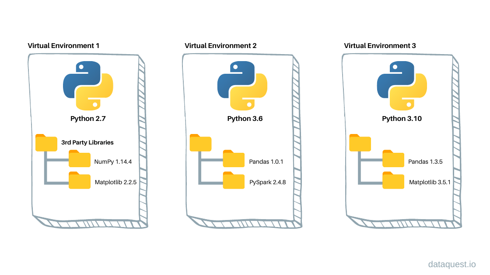

# Django Questions


## What is the difference between Flask and Django?


| Feature               | Flask                                     | Django                           |
|-----------------------|-------------------------------------------|----------------------------------|
| **Type**              | Microframework                            | Full-stack framework             |
| **Complexity**        | Lightweight, minimalistic                 | More complex, batteries-included |
| **Flexibility**       | High (you choose components)              | Low (comes with built-in tools)  |
| **Database Support**  | No built-in ORM                           | Built-in ORM (Django ORM)        |
| **Admin Interface**   | Not included                              | Built-in admin interface         |
| **Learning Curve**    | Easier for beginners                      | Steeper learning curve           |
| **Use Case**          | Small to medium projects                  | Large, complex projects          |
| **Template Engine**   | Jinja2 (default)                          | Django Template Language         |
| **REST API Support**  | Requires extensions (e.g., Flask-RESTful) | Built-in (Django REST Framework) |
| **Community**         | Large, but smaller than Django            | Very large and mature            |
---

## What is Django?

- Django is python based web deveolpment Framwork.
- Free and Open-source.
- comes with ready-to-use features like login system, database connection and CRUD operations.
---

## How does Django Work?

**Django follows the MVT design pattern (Model View Template).**

- Model: The data you want to present, usually data from a database.
- View: A request handler that returns the relevant template and content based on the request from the user
- Template: A text file (like an HTML file) containing the layout of the web page, with logic on how to display the  data.


**Model**

- In Django, the data is delivered as an Object Relational Mapping (ORM), which is a technique designed to make it   easier to work with databases.
- The most common way to extract data from a database is SQL. One problem with SQL is that you have to have a pretty good understanding of the database structure to be able to work with it.
- Django, with ORM, makes it easier to communicate with the database, without having to write complex SQL statements.
- The models are usually located in a file called `models.py.`


**View**

- A view is a function or method that takes http requests as arguments, imports the relevant model(s), and finds out what data to send to the template, and returns the final result.
- The views are usually located in a file called `views.py.`


**Template**

- A template is a file where you describe how the result should be represented.
- Templates are often `.html` files, with HTML code describing the layout of a web page, but it can also be in other file formats to present other results, but we will concentrate on `.html` files.
- Django uses standard HTML to describe the layout, but uses Django tags to add logic:


**URLs**

- Django also provides a way to navigate around the different pages in a website.
- When a user requests a URL, Django decides which view it will send it to.
- This is done in a file called `urls.py.`


---

## How MVT pattern Django's approach work under the hood?

1. Django receives the URL, checks the `urls.py` file, and calls the view that matches the URL.
2. The view, located in `views.py`, checks for relevant models.
3. The models are imported from the `models.py` file.
4. The view then sends the data to a specified template in the `template` folder.
5. The template contains HTML and Django tags, and with the data it returns finished HTML content back to the browser.
---

## What is Virtual Environment ?



- A virtual environment is a tool that helps to keep dependencies required by different projects separate by creating isolated Python virtual environments for them. This is one of the most important tools that most Python developers use.

### Why do we need a virtual environment?
- Creating a Python virtual environment allows you to manage dependencies separately for different projects, preventing conflicts and maintaining cleaner setups. With Python’s venv module, you can create isolated environments that use different versions of libraries or Python itself.
---

## How to Create a Django Project

1. **First, create a directory for the project:**

   

   - Use the following command to create a directory:
     ```bash
     mkdir first_project
     ```
   - Navigate into the directory:
     ```bash
     cd first_project
     ```

---

2. **Set up a virtual environment:**

   

   - Create a virtual environment using:
     ```bash
     python -m venv env
     ```
   - If you encounter issues, install `virtualenv` globally:
     ```bash
     pip install virtualenv
     ```
     Then, try creating the virtual environment again.

---

3. **Activate the virtual environment:**

   

   - On macOS/Linux:
     ```bash
     source env/bin/activate
     ```
   - On Windows:
     ```bash
     env\Scripts\activate
     ```

---

4. **Install Django:**

   

   - Use `pip` to install Django:
     ```bash
     pip install Django
     ```

---

5. **Create a Django project:**

   

   - Use the `django-admin` command to create a new project:
     ```bash
     django-admin startproject login_system
     ```
     - **`django-admin`**: Django’s command-line utility for administrative tasks.
     - **`startproject`**: The command to create a new Django project.
     - **`login_system`**: The name of your project.

---

6. **Navigate into the project directory:**

   - Move into the newly created project directory:
     ```bash
     cd login_system
     ```

---

7. **Run the development server:**

   

   - Start the Django development server:
     ```bash
     python manage.py runserver
     ```

---

8. **Verify the project:**

   - Open your browser and navigate to:
     ```
     http://127.0.0.1:8000/
     ```
   - If everything is set up correctly, you should see the Django welcome page:

     

---
### Django Project Structure

```
first_project/
├── manage.py
├── login_system/
│   ├── __init__.py
│   ├── asgi.py
│   ├─ settings.py
│   ├─ urls.py
│   ├── wsgi.py
```
- first_project/: is your top-level project folder.
- first_project/login_system/: is your lower-level folder that represents your management app.
- manage.py: is a Python file that serves as the command center of your project. It does the same as the django-admin command-line utility.
- settings.py: this file houses the settings that configure your Django project. From database configurations to middleware lists, this is where you define how your application functions. It’s akin to the blueprint that shapes the structure of your project’s behavior.
- urls.py: The URL dispatcher — encoded within urls.py—maps URLs to views. This file determines which view is displayed when a specific URL is accessed. It's like a roadmap that navigates users through the intricacies of your application's pages.
- wsgi.py: Short for Web Server Gateway Interface, wsgi.py serves as the entry point for your application when deployed on a production server. It's the bridge connecting your application to the web server, enabling it to handle incoming requests.
- asgi.py: Similar to wsgi.py, asgi.py is the entry point for asynchronous web servers. It stands for Asynchronous Server Gateway Interface and facilitates the handling of asynchronous HTTP requests.
- __ init __.py:  Python uses this file to declare a folder as a package, which allows Django to use code from different apps to compose the overall functionality of your web application. You probably won’t have to touch this file.

---
### Django app

- Every project you build with Django can contain multiple Django apps. When you ran the startproject command in the previous section, you created a management app that you’ll need for every default project that you’ll build. Now, you’ll create a Django app that’ll contain the specific functionality of your web application.
- python manage.py startapp < appname >

``python manage.py startapp login_app`` 
  


- Once the startapp command has finished execution, you’ll see that Django has added another folder to your folder structure:

```
first_project/
│
├── login_app/
│   │
│   ├── migrations/
│   │   └── __init__.py
│   │
│   ├── __init__.py
│   ├── admin.py
│   ├── apps.py
│   ├── models.py
│   ├── tests.py
│   └── views.py
│
├── login_system/
│   ├── __init__.py
│   ├── asgi.py
│   ├── settings.py
│   ├── urls.py
│   └── wsgi.py
│
└── manage.py
```

- models.py: This is where you define the data structures using Django's ORM (Object-Relational Mapping). Each model class represents a table in the database. This file forms the foundation of your application's data management.
- views.py: file encapsulates the logic that defines how your application interacts with users' requests. Views handle data processing, rendering templates, and responding to actions. This file transforms user interactions into tangible responses.
- tests.py: Here, you write unit tests to ensure your application's components function as expected. These tests bolster the reliability and stability of your codebase.
- admin.py: he admin.py file isn't just for administrators—it configures how your application's models are presented in Django's admin interface. This file allows administrators to manage data seamlessly.
- migrations: This directory is a blueprint of all changes in your application models.
- Other Files: Additional files might surface based on your application’s needs. For instance, forms.py houses form classes for data input, urls.py maps URLs to views, and apps.py manages application-specific configurations.

---

### Directory Hierarchy

- Maintaining a clean and organized project structure is crucial for the readability, scalability, and maintainability of your Django project. Following best practices in project structuring ensures that your codebase is easily understandable and adaptable.

```
first_project/
├── manage.py
├── login_system/
│   ├── __init__.py
│   ├── asgi.py
│   ├─ settings.py
│   ├─ urls.py
│   ├── wsgi.py
├── login_app/
├── logout_app/

├── static/
├── media/
├── templates/

```

- first_project: The root directory of your project.
- first_project/login_system/:This inner directory holds core project settings and configuration.
- login_app & logout_app: These are the individual apps you create within the project.
- static: Houses static files like CSS, JavaScript, and images.
- media: Stores user-uploaded files.
- templates: Contains HTML templates.

---

### What is Django Admin ?

- The Django admin panel is a built-in, user-friendly interface that allows developers and administrators to manage the data and administration of a Django project effortlessly. It provides a convenient way to perform common tasks such as creating, reading, updating, and deleting data in your database without having to write custom views or templates.


- To enter the admin user interface, start the server by navigating to the /first_project folder and execute this command: `py manage.py runserver`

- In the browser window, type 127.0.0.1:8000/admin/ in the address bar.


-The reason why this URL goes to the Django admin log in page can be found in the urls.py file of your project:

```
    urlpatterns = [
        path('admin/', admin.site.urls),
    ]
```

- The urlpatterns[] list takes requests going to admin/ and sends them to admin.site.urls, which is part of a built-in application that comes with Django, and contains a lot of functionality and user interfaces, one of them being the log-in user interface.

- To be able to log into the admin application, we need to create a user.

```
  $ python manage.py createsuperuser
  Username: admin
  Email address: admin@example.com
  Password: ********
  Password (again): ********
  Superuser created successfully.
```

---

### Django Admin Commands

| **Command**                          | **Description**                                                                 |
|--------------------------------------|---------------------------------------------------------------------------------|
| `django-admin startproject <name>`   | Creates a new Django project with the specified name.                           |
| `django-admin startapp <name>`       | Creates a new Django app within the project.                                    |
| `python manage.py runserver`         | Starts the Django development server.                                           |
| `python manage.py migrate`           | Applies database migrations to sync the database with your models.              |
| `python manage.py makemigrations`    | Creates new migrations based on changes to your models.                         |
| `python manage.py createsuperuser`   | Creates a superuser for accessing the Django admin interface.                   |
| `python manage.py collectstatic`     | Collects static files into the directory specified in `STATIC_ROOT`.            |
| `python manage.py shell`             | Opens the Django interactive shell with the project’s settings loaded.          |
| `python manage.py test`              | Runs tests for all installed apps.                                              |
| `python manage.py flush`             | Deletes all data from the database and re-applies migrations.                   |
| `python manage.py dbshell`           | Opens the database shell for the database specified in `settings.py`.           |
| `python manage.py showmigrations`    | Lists all migrations and their status (applied or not).                         |
| `python manage.py sqlmigrate <app> <migration>` | Prints the SQL statements for a specific migration.             |
| `python manage.py check`             | Checks the entire Django project for common problems.                           |
| `python manage.py changepassword <username>` | Changes the password for a user.                                |
| `python manage.py clearsessions`     | Clears expired sessions from the session store.                                 |
| `python manage.py compilemessages`   | Compiles `.po` files into `.mo` files for translation.                          |
| `python manage.py inspectdb`         | Inspects the database and generates Django models for existing tables.          |
| `python manage.py loaddata <fixture>`| Loads data from a fixture (e.g., JSON or XML) into the database.                |
| `python manage.py dumpdata <app>`    | Dumps data from the database into a fixture (e.g., JSON or XML).                |

---

# Resources:
. [Django](https://www.djangoproject.com/)
. [realpython](https://realpython.com/tutorials/django/)
. [w3schools](https://www.w3schools.com/django/index.php)
. [medium](https://medium.com/django-unleashed/django-project-structure-a-comprehensive-guide-4b2ddbf2b6b8)
